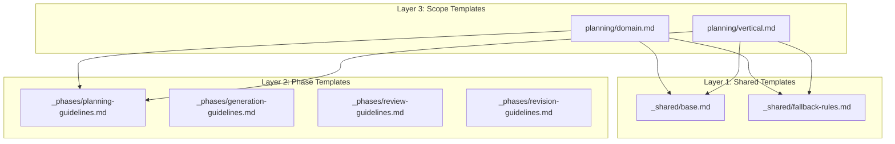

# ADR-0002: Layered Template Composition System

**Status:** Superseded (v2.0)
**Date:** December 9, 2024
**Last Updated:** January 12, 2025 (archived)
**Superseded By:** Flat template approach with simple `{{placeholder}}` substitution
**Deciders:** Scott

> **Archive Note:** This ADR describes template layering implemented in v1.x. In v2.0, the jpa-mt profile was simplified to use flat templates (`.md` files) with placeholder substitution only. The `template_renderer.py` code remains for future profiles but is unused by jpa-mt. See [ADR-0008](../0008-engine-profile-separation-of-concerns.md) for v2.0 simplification decisions.

---

## Context and Problem Statement

The JPA multi-tenant (JPA-MT) profile in the AI workflow engine needs to generate AI prompts for multiple **phases** (planning, generation, review, revision) and multiple **scopes** (domain, vertical).

A naive implementation would define one large, monolithic Markdown template per (phase, scope) pair. For the JPA-MT profile alone, this yields:

- **4 phases × 2 scopes = 8 templates**

All of these templates share substantial duplicated content:

- AI persona and role description
- File attachment descriptions and validation rules
- Standards priority rules
- Fallback behavior when standards are silent
- Phase-specific guidance (e.g., planning vs generation)

This duplication leads to:

1. **High maintenance cost** – Shared content must be edited in many files.
2. **Inconsistency risk** – Copy/paste drift can cause divergent templates.
3. **Poor clarity** – Difficult to distinguish universal, phase-specific, and scope-specific content.
4. **Poor scalability** – Adding new phases or scopes multiplies duplication.

We need a way to compose templates from reusable components that keeps templates readable and avoids introducing a heavy external templating engine.

---

## Decision Drivers

- **DRY (Don't Repeat Yourself)** – Shared content must be defined once.
- **Maintainability** – Updates to any layer should flow automatically.
- **Clarity** – Layers should communicate intent clearly.
- **Simplicity** – Markdown-first, with minimal custom syntax.
- **Low dependency footprint** – No external engines required.
- **Runtime composition** – Templates assembled dynamically at render time.
- **Extensibility** – Easy to add new scopes or phases.

---

## Considered Options

### Option 1: Monolithic Templates (Baseline)

**Pros**
- Very simple to understand.
- No composition code needed.

**Cons**
- Massive duplication.
- High inconsistency risk.
- Hard to read and maintain.
- Does not scale.

**Verdict**
❌ **Rejected**

---

### Option 2: Build Templates in Python

**Pros**
- Avoids duplication.
- Full control over assembly.

**Cons**
- Template text lives in Python instead of Markdown.
- Mixed concerns (code + content).
- Harder for non-Python contributors.

**Verdict**
❌ **Rejected**

---

### Option 3: Use Jinja2 or Similar Templating Engine

**Pros**
- Powerful and well-supported tools.
- Built-in includes and inheritance.

**Cons**
- Overkill for our use case.
- Adds an unnecessary dependency.
- Increases contributor learning curve.

**Verdict**
⚠️ **Rejected for now**

---

### Option 4: Custom `{{include:}}` Directives (Chosen)

**Pros**
- Simple, readable syntax.
- Templates remain pure Markdown.
- Minimal implementation.
- Aligns with existing `{{PLACEHOLDER}}` system.
- Clear layering system.

**Cons**
- Requires custom implementation for include resolution.
- Contributors must learn include semantics (small burden).

**Verdict**
✅ **Accepted**

---

## Architecture Overview

### Layer Structure

Templates are organized into three layers:

1. **Layer 1 – Shared Templates (`_shared/`)**
   Contains universal content:
   - Persona + metadata
   - File attachments
   - Standards priority rule
   - Fallback rules

2. **Layer 2 – Phase Templates (`_phases/`)**
   Contains phase-specific behaviors:
   - Planning guidelines
   - Generation guidelines
   - Review guidelines
   - Revision guidelines

3. **Layer 3 – Scope Templates (`planning/`, `generation/`, `review/`, `revision/`)**
   Contains scope-specific content and includes Layers 1 and 2.

### Directory Layout

```
profiles/jpa_mt/templates/
├── _shared/
│   ├── base.md
│   └── fallback-rules.md
│
├── _phases/
│   ├── planning-guidelines.md
│   ├── generation-guidelines.md
│   ├── review-guidelines.md
│   └── revision-guidelines.md
│
├── planning/
│   ├── domain.md
│   └── vertical.md
├── generation/
│   ├── domain.md
│   └── vertical.md
├── review/
│   ├── domain.md
│   └── vertical.md
└── revision/
    ├── domain.md
    └── vertical.md
```

---

## Diagram: Template Composition Flow



---

## Include Resolution Rules

### Relative Includes
Paths beginning with `./` or `../` are resolved relative to the directory of the including file.

Examples (from `planning/domain.md`):
- `{{include: ./fragments/header.md}}` → `planning/fragments/header.md`
- `{{include: ../common/shared.md}}` → `common/shared.md`

### Absolute-Style Includes
All other paths are resolved relative to the **templates root** (`profiles/jpa_mt/templates/`).

Examples:
- `{{include: _shared/base.md}}` → `templates/_shared/base.md`
- `{{include: _phases/planning-guidelines.md}}` → `templates/_phases/planning-guidelines.md`

### Best Practices
- Use **absolute-style includes** (`_shared/...`, `_phases/...`) for Layers 1 and 2.
- Use relative includes only for small, file-local fragments.

---

## Example: Before and After

### Before (Monolithic Planning Domain Template)
- ~3000 lines
- ~85% duplicated across templates

### After (Layered Planning Domain Template)

```markdown
{{include: _shared/base.md}}
{{include: _shared/fallback-rules.md}}
{{include: _phases/planning-guidelines.md}}

---

# Domain Layer Planning Request

## Domain-Specific Requirements
[~500 lines]
```

**Result:**
- Duplicated content moved to shared layers
- Scope template reduced by ~80%
- Updating persona or fallback rules requires editing **one file**, not eight

---

## Implementation Details

### Template Composition

The JPA-MT profile resolves include directives:

- Loads the scope template (e.g., `planning/domain.md`)
- Recursively replaces all `{{include: ...}}` directives
- Produces a fully composed Markdown template
- Applies placeholder substitution using the workflow context

### Code Locations

- **Include resolution:**
  `profiles/jpa_mt/jpa_mt_profile.py::_resolve_includes()`
- **Generic template utilities:**
  `aiwf/domain/template_renderer.py` — `render_template()`, `resolve_includes()`, `fill_placeholders()`

---

## Consequences

### Positive
- Eliminates duplication across templates.
- Updates to shared content propagate automatically.
- Clear, explicit layering with simple mental model.
- Maintains readable Markdown templates.
- Scales cleanly with new scopes or phases.

### Negative
- Requires learning the `{{include: ...}}` directive.
- Composition happens at runtime (acceptable for our use case).

---

## Validation and Test Coverage

Tests verifying correct behavior are located in:

`tests/unit/profiles/jpa_mt/test_template_renderer.py`

Key tests:

- **include resolution**
  - `test_render_template_resolves_includes`
  - `test_render_template_composes_layered_templates`
- **placeholder substitution**
  - `test_render_template_fills_placeholders`
  - `test_fill_placeholders_all_replaced`
- **error handling**
  - `test_render_template_missing_required_context`
  - `test_render_template_invalid_phase`
  - `test_render_template_invalid_scope`
- **integration**
  - `test_integration_full_workflow`

All tests are passing.

---

## Related Decisions

- **ADR-0001 – Architecture Overview** documents the profile-based workflow architecture.
Future ADRs may refine this approach if additional template logic becomes necessary.

---

## Status

**Superseded (v2.0)** — Implemented in v1.x, replaced by flat templates in v2.0.